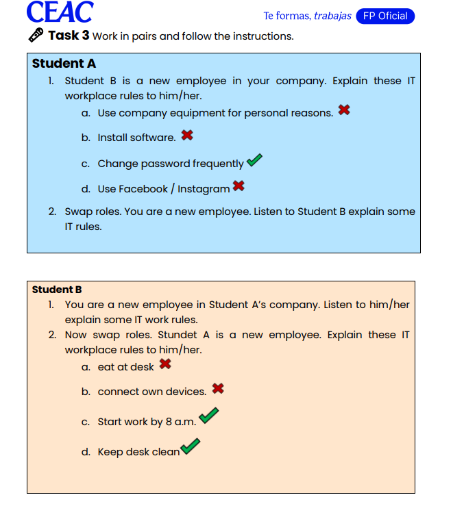
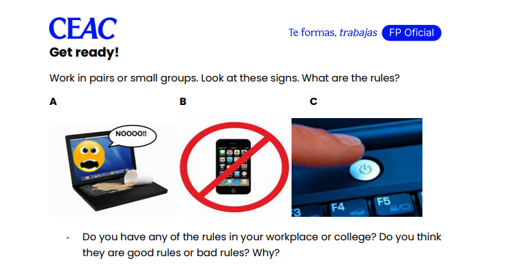

## listening

|               | Lateefa                                      | Ivan                        |
|---------------|-----------------------------------------------|-----------------------------|
| ✔ Allowed     | • Ask a technician to install software        | • He can use email for personal comunacacion |
|               | • work at home                   | • he can install |
| ❌ Not allowed| • using a personal phine                    | • Phone is banned |
|               | • instaling software                   | •  |

## Dialog 

 hi my name a Bohdan and our boss say to me to explain to you company rule 

You not allowed to use company equipment like computers  fax projectors   for personal reasons. 

you mustnt install software buy our own witho out talk with sup tech

you can change password fregequnlty 

you vant use Face

any questiing that you need ask b4 to work
and welcome to our company good luck

## Task 2 Complete this conversation between two people from different
IT companies using the words in brackets to make questions in Present
Simple. Then listen and check your answers.
A: So (1) __what do you do in your company__ (your company)?
B: Well, we mostly develop apps for Apple and Android devices – iPhones,
that kind of thing.
A: And (2) __How a are tour customers__ (your customers)?
B: Mm... they could be anyone, really. For example, many are companies,
wanting an app to show their products. We also do a lot of work for
educational organisations. They often want apps to help people learn
something.
A: (3) __Do you  company produce any hardware__  (produce any hardware)?
B: No, that’s a very different field. All your products are software. But we do
work closely with hardware manufacturers to make sure our software works
well.
A: And (4) __D you have any future plans__ (future plans)?
B: Good question! We have a product launch tomorrow night. (5)
__Do you want to come__ (want/come)?

## 

You shouldnt eat or drink in front of the PC mustnt
arent Phines a allowed 
You must to power of a pc 

## Task 1 Read the memo and find words that match these definitions. Then compare answers with your partner.
FROM: Chief Information Officer  
TO: All staff  
DATE: 16 June  
SUBJECT: IT security  
As you know, many new staff have joined us at XBM Digital recently, so now is
a good time for a reminder about some of our rules. Security is important, and
these rules will help us to keep our IT systems and data secure.
Firstly, passwords are important for keeping the network secure. Don't use
common words or numbers as passwords, such as birthdays or names of
your children. Passwords must be alphanumeric and be at least eight
characters long. You need to change your password every month or more
frequently. Also, you should not share it with anyone, including your
colleagues.

1. Person in charge of IT __Cto/cio__
2. Keeping something safe __secure__
3. Information such as numbers and details about people __personal informacion__
4. A secret word that you type into a computer before you can use it __password__
5. A group of connected computers __network__
6. Having only letters and numbers __alphanumeric__
7. Letters, numbers, punctuation marks, etc. __characters__
8. People you work with __colleagues__

# Activity 1
## Complete the following sentences with the most appropriate modal verb from the list below.
can / could / must / mustn’t / should / shouldn’t / have to 
don’t have to / ought to / ought not to
1. The advice from the health committee is that all people with symptoms
__must__ go to the doctor.
2. This is a non-smoking area, you __mustn’t / dont have to__  smoke here.
3. I hate big multinational companies. I think they __should__ pay more taxes.
4. When she was 4 years old, she __could__ read perfectly well.
5. I __should__ get up early tomorrow; I want to go running very early.
6. You __shouldnt__ eat so many sweets. They are bad for you.
7. We __have to__ wear a tie at work. I hate it!
8. The board agreed that employers __should__ have access to an employee's medical file.
9. I'm not working tomorrow, so I __dont have to__ get up early.

# 25/11/2025
# Task 2
These seems to be a techinical issue - Looks like something is wrong
restart the device , please - try rebooting it
The program does not funcion correctly  - Thr app isn  working
Send me the file when you can - shoot me file when you get sec 
I recomend a updating your software - You should update software

## Task  
sort out - resolvet  
run into  - investigate - расследовать

## Task 6
Plese wait a moment i am checking the system -- wait a min  i am cheking it 
You do hot have permesion to install rhe software - looks like you dont have   rights to install this app
I belive the issue related to the network configuration - Think  its a network cofig
I will send you the updated code as soon as posible  - I`ll shoot you the update code asap
Could you provide more information about the error -- Got more info bount rhe error